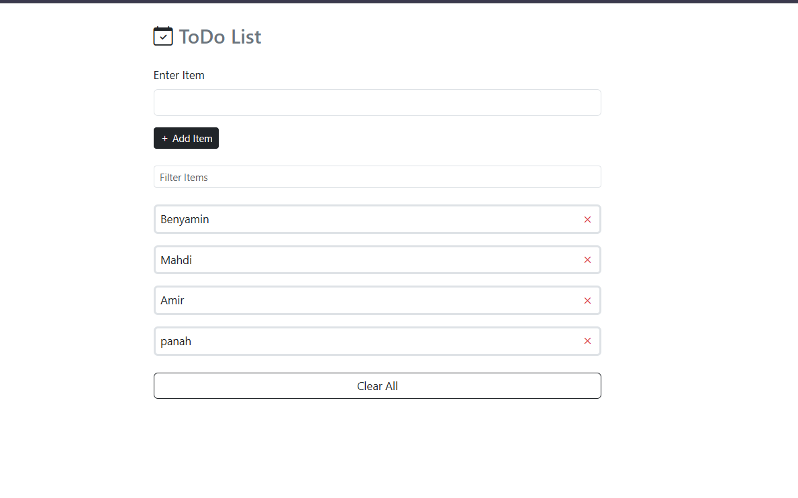

<h1 align="center">✅ Todo-Page</h1>

<p align="center">
  A modern, simple and clean <b>ToDo List Web App</b> built using 
  <b>HTML · CSS · JavaScript</b>.
</p>

<p align="center">
  
  
  
</p>

---

## 🚀 Features

- ✅ Add new tasks  
- 🗑 Remove tasks  
- 🔍 Search & filter tasks  
- 🎨 Clean, minimal and 
- ⚡ Fast & lightweight — Vanilla JS only  

---

## 🔮 Upcoming Features (Planned)

These features will be added in future versions:

- ✅ **Mark tasks as completed**
- ✅ **Strike-through style for finished tasks**
- ✅ **Edit existing tasks**
- ✅ **LocalStorage saving system**
- ✅ **Improved UI animations**

---

## 📸 Preview 



---

## 🔥 Live Demo (GitHub Pages)

<p align="center">
  <a href="https://benyamin012.github.io/Todo-Page/" target="_blank">
    🚀 <b>Click here to view the live project</b>
  </a>
</p>


---
## 🛠 Technologies Used

- **HTML5**
- **CSS3**
- **JavaScript (ES6)**

---
👨‍💻 Author

Benyamin Mashmool
Front-End Developer

⭐ Support the Project

If you like this project, please consider giving it a ⭐ star on GitHub — it helps a lot!

<p align="center">Made with ❤️ & JavaScript</p> ```
